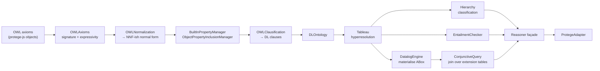

# DL-JS-REASONER

A **hypertableau OWL 2 DL reasoner in pure JavaScript**, modelled closely on
[HermiT](http://www.hermit-reasoner.com/) (Shearer, Motik & Horrocks, OWLED 2008).

It exists to fill a specific gap: [`protege-js`](../protege-js) ships excellent
OWL 2 parsers, a model layer and three **forward-chaining** reasoners
(OWL 2 RL, QL, EL). Those are rule-based materialisers — they can only derive
what their fixed rule sets allow. They cannot answer the questions that need a
**tableau calculus**:

| Question | protege-js RL/QL/EL | DL-JS-REASONER |
|---|---|---|
| Is this ontology consistent? | only for RL-detectable clashes | **yes, full OWL 2 DL** |
| Is this *arbitrary* class expression satisfiable? | no | **yes** |
| Is `C ⊑ D` for general `C`, `D` (negation, unions, nominals)? | no | **yes** |
| Complete classification of non-Horn ontologies | no | **yes** |
| Realisation (most specific types) | no | **yes** |
| `owl:DisjointUnionOf`, `HasKey`, cardinality restrictions | no | **yes** |
| Anonymous-individual (graph) entailment | no | **yes** |
| Conjunctive query answering (multi-atom joins over the ABox) | no query API — only a materialised triple store | **yes** (Horn ontologies) |
| A command-line reasoner (`-k`, `-c`, `-U`, `-E`, …) | no CLI at all | **yes** — see [Command line](#command-line) |

It consumes **protege-js-shaped objects** directly, so you can parse an ontology
with protege-js and reason over it with this package.

---

## Install

```bash
npm install dl-js-reasoner
```

`@skaterqiang/protege-js` is an **optional** peer dependency. You only need it
if you want to parse `.owl`/`.rdf`/`.ofn` files; if you build axioms with the
bundled `OWLExpressions` factories, nothing else is required.

Requires Node.js ≥ 18. No native modules, no WASM, no network access.

---

## Quick start

### With protege-js (parse a file)

```js
const protege = require('@skaterqiang/protege-js');
const { reasonerFor } = require('dl-js-reasoner');

const ontology = new protege.OntologyLoader().loadFromFile('sample/ontologies/bfo.owl');

const r = reasonerFor(ontology);

console.log(r.isConsistent());                       // true
console.log(r.getTopClasses());                      // ['http://…#BFO_0000001']
console.log(r.isSubClassOf(EX + 'Process', EX + 'Occurrent'));  // true
console.log(r.getSubClasses(EX + 'Continuant', { direct: true }));

r.dispose();
```

Every query method accepts **either an IRI string or an OWL expression object**,
and every class/property/individual query returns a **sorted array of IRI
strings** (or protege-js `OWLLiteral`s for data-property values).

### Without protege-js (build axioms in memory)

```js
const { createReasoner, E } = require('dl-js-reasoner');

const EX = 'http://example.org/#';
const Person = E.owlClass(EX + 'Person');
const Man    = E.owlClass(EX + 'Man');
const Woman  = E.owlClass(EX + 'Woman');

const axioms = [
  { axiomType: E.AxiomType.DECLARATION, entity: Person },
  { axiomType: E.AxiomType.DECLARATION, entity: Man },
  { axiomType: E.AxiomType.DECLARATION, entity: Woman },
  E.subclassOf(Man, Person),
  E.subclassOf(Woman, Person),
  E.disjointClasses([Man, Woman])
];

const reasoner = createReasoner({ getAxioms: () => axioms });

reasoner.isConsistent();                                    // true
reasoner.isSatisfiable(E.objectIntersectionOf([Man, Woman])); // false
reasoner.isSubClassOf(Man, Person);                          // true
```

The only requirement on the ontology argument is a `getAxioms()` method
returning an array. A `getOntologyID()` is used if present.

Run `npm run demo` for a full guided tour.

---

## Public API

```js
const DL = require('dl-js-reasoner');
```

### Entry points

| Export | Description |
|---|---|
| `reasonerFor(ontology, config?)` | Ergonomic adapter. IRI strings in, sorted IRI arrays out. **Recommended.** |
| `ProtegeAdapter` | The class behind `reasonerFor`. Exposes `.reasoner` for anything unwrapped. |
| `createReasoner(ontology, config?, options?)` | The raw OWL-API-style reasoner. Takes/returns expression objects and `Node`/`NodeSet`. |
| `createNonBufferingReasoner(ontology, config?)` | Same, but changes apply immediately instead of being buffered until `flush()`. Returns a **raw `Reasoner`**. |
| `Configuration`, `PrepareReasonerInferences` | Configuration object and its inference-preparation flags. |
| `DIRECT_BLOCKING_TYPE`, `BLOCKING_STRATEGY_TYPE`, `BLOCKING_SIGNATURE_CACHE_TYPE`, `EXISTENTIAL_STRATEGY_TYPE`, `TABLEAU_MONITOR_TYPE`, … | The configuration enums, exported flat as well as being statics on `Configuration`. See [Blocking](#blocking) and [Monitors](#monitors). |
| `E` / `OWLExpressions` | Expression & axiom factories (`owlClass`, `objectSomeValuesFrom`, `subclassOf`, …), `AxiomType`, `EntityType`, `ClassExpressionType`. |
| `Node`, `NodeSet` | Hierarchy answer containers. |
| `EntailmentChecker` | Low-level arbitrary-axiom entailment engine. |
| `DLPredicate`, `DLOntology`, `OWLClausification`, `Tableau` | Structural layer, exposed for debugging and experimentation. |
| `ReducedABoxOnlyClausification`, `INDIVIDUAL_AXIOM_TYPES`, `INCREMENTAL_CLASS_EXPRESSION_TYPES` | Incremental ABox loading: the assertion-only clausifier and the shape whitelists `canProcessPendingChangesIncrementally()` gates on. |
| `DatalogEngine`, `ConjunctiveQuery`, `QueryResultCollector`, `CollectingQueryResultCollector`, `buildQuerySpec`, `toAtom`, `toTerm`, `querySpecToString` | Conjunctive query answering. The everyday route is the spec-based one (`reasoner.query({ select, where })`); these are for hand-building atoms/terms or subclassing the collector. See [Conjunctive query answering](#conjunctive-query-answering). |
| `createAtom`, `Term`, `Variable`, `Individual`, `Constant`, `createVariable`, `createIndividual`, `createConstant` | Term & atom factories, so a hand-built query needs no deep requires. |
| `CommandLine`, `CliWriter`, `CliOptions` | The command-line front end: `main(argv, io)` returns an exit code, `parseArguments(argv)` returns the plan without loading, `CliWriter` has the `Writer`/`StringWriter`/`StreamWriter`/`FileWriter`/`openWriter` sinks, and `CliOptions` has `Getopt`, the option table and the help formatter. See [Command line](#command-line). |
| `HierarchyDumperFSS`, `HierarchyPrinterFSS` | HermiT's functional-syntax hierarchy output — the flat `SubClassOf( <a> <b> )` dump and the indented, prefix-abbreviated `Ontology( … )` document. The everyday route is `reasoner.dumpHierarchies(out, …)` / `reasoner.printHierarchies(out, …)`. |
| `Prefixes` | Abbreviated-IRI rendering. |
| `REASONER_NAME`, `REASONER_VERSION` | `'DL-JS-REASONER'`, and the version read straight from `package.json` (currently `'0.3.0'`) — there is a single source of truth, mirroring HermiT's manifest lookup. |

### `ProtegeAdapter` methods

**Lifecycle** — `applyChange`, `applyChanges`, `getPendingChanges`,
`canProcessPendingChangesIncrementally`, `flush`,
`dispose`, `interrupt`, `getBufferingMode`

**Consistency & satisfiability** — `isConsistent`, `isSatisfiable`,
`getUnsatisfiableClasses`

**Class hierarchy** — `isSubClassOf`, `getSuperClasses`, `getSubClasses`,
`getEquivalentClasses`, `getDisjointClasses`, `getTopClasses`

**Individuals** — `getInstances`, `getTypes`, `hasType`, `getSameIndividuals`,
`isSameIndividual`, `getDifferentIndividuals`

**Property values** — `getObjectPropertyValues`, `getDataPropertyValues`,
`hasObjectPropertyRelationship`

**Object properties** — `isSubObjectPropertyOf`, `getSuperObjectProperties`,
`getSubObjectProperties`, `getEquivalentObjectProperties`,
`getInverseObjectProperties`, `getDisjointObjectProperties`,
`getObjectPropertyDomains`, `getObjectPropertyRanges`

**Data properties** — `isSubDataPropertyOf`, `getSuperDataProperties`,
`getSubDataProperties`, `getEquivalentDataProperties`,
`getDisjointDataProperties`, `getDataPropertyDomains`

**Characteristics** — `isFunctional`, `isInverseFunctional`, `isSymmetric`,
`isAsymmetric`, `isTransitive`, `isReflexive`, `isIrreflexive`

**Entailment** — `isEntailed(axiom)`, `isEntailmentCheckingSupported(type)`

**Conjunctive query answering** — `query(spec)`, `answerQuery(spec)`,
`createQuery(spec)`, `getDatalogEngine()`, `getQueryRepresentative(iri)`.
See [Conjunctive query answering](#conjunctive-query-answering).

**Precomputation** — `precomputeInferences(...types)`, `isPrecomputed(type)`,
`getPrecomputableInferenceTypes()`, plus chainable `classify()`,
`classifyClasses()`, `classifyObjectProperties()`, `classifyDataProperties()`,
`realise()`

**Metadata** — `getReasonerName`, `getReasonerVersion`, `getRootOntology`,
`getConfiguration`, `getPrefixes`, `getTableauStatistics`, `getDLOntology`

### Configuration

```js
reasonerFor(ontology, {
  throwInconsistentOntologyException: false,  // default true
  bufferChanges: true,                        // default true
  freshEntityPolicy: 'ALLOW',                 // or 'DISALLOW'
  individualNodeSetPolicy: 'BY_NAME',         // or 'BY_SAME_AS'
  blockingStrategyType: 'OPTIMAL',            // ANYWHERE | ANCESTOR honoured; *_CORE degrade
  directBlockingType: 'OPTIMAL',              // SINGLE | PAIR_WISE | OPTIMAL (all honoured)
  blockingSignatureCacheType: 'CACHED',       // | NOT_CACHED (all honoured)
  existentialStrategyType: 'CREATION_ORDER',  // | INDIVIDUAL_REUSE | EL
  ignoreUnsupportedDatatypes: false,          // true = skip axioms with unknown datatypes
  useDisjunctionLearning: true,
  individualTaskTimeout: -1,                  // ms; -1 = no limit
  tableauMonitorType: 'NONE',                 // NONE | TIMING | TIMING_WITH_PAUSE | DEBUGGER_*
  monitorOptions: null,                       // passed to the well-known monitor (see below)
  monitor: null                               // your own monitor object; forked with the above
});
```

A plain object is accepted anywhere a `Configuration` is expected. The
constructor ends with `Object.assign(this, overrides)`, so **any** public field
is settable this way.

### Monitors

A *tableau monitor* observes the reasoning run without changing it: how many
tests ran, how often the calculus backjumped, how many nodes were created or
blocked, and how long each task took. `TABLEAU_MONITOR_TYPE` selects a built-in
one, and `monitor` supplies your own; when **both** are set they are combined
with a `TableauMonitorFork` so each hook reaches both (exactly as HermiT does).

| `tableauMonitorType` | Monitor installed |
|---|---|
| `NONE` (default) | none — only your `monitor`, if any |
| `TIMING` | `Timer` — prints a per-test statistics report |
| `TIMING_WITH_PAUSE` | `TimerWithPause` — `Timer` plus a pause after each report (interactive terminal only; on a non-TTY stdin it degrades to `Timer`) |
| `DEBUGGER_NO_HISTORY` / `DEBUGGER_HISTORY_ON` | `CountingMonitor` (the interactive `Debugger` is not ported) |

An unknown value throws rather than being silently ignored.

```js
const { createReasoner, CountingMonitor, TABLEAU_MONITOR_TYPE } = require('dl-js-reasoner');

// Built-in counting monitor, selected by enum:
const r = createReasoner(ontology, { tableauMonitorType: TABLEAU_MONITOR_TYPE.TIMING });

// Or compose one yourself and read the counters afterwards:
const monitor = new CountingMonitor();
const r2 = createReasoner(ontology, { monitor });
r2.isEntailed(axiom);
console.log(monitor.getSummary());
// → { tests, timeMs, backtracks, nodes, blockedNodes, clashes }

// Capture the Timer's report instead of printing it to stdout:
const lines = [];
const r3 = createReasoner(ontology, {
  tableauMonitorType: TABLEAU_MONITOR_TYPE.TIMING,
  monitorOptions: { write: (t) => lines.push(t), writeLine: (t) => lines.push(t + '\n') }
});
```

`CountingMonitor` groups its records by reasoning-task description
(`getUsedMessagePatterns()`, `getTimeSortedTestRecords(limit, pattern)`) and
`reset()` clears every counter. `MemoryConsumptionMonitor` extends it to report
current / average / peak tableau-expansion memory (estimated bytes, since this
port has no `sizeInMemory()`; roles live in the arity-3 table, so prefer
`getExtensionTableMemoryByArity(n)` over HermiT's binary/ternary getters). To
write your own monitor, subclass `TableauMonitorAdapter` — it declares all 23
hooks this tableau fires as no-ops, so you only override what you care about.
All six classes are exported from the package index.

> A monitor is a **diagnostic** component: it must never be able to break a
> reasoning run. `CountingMonitor` therefore treats a missing or
> partially-initialised tableau as zero rather than throwing.

### Blocking

Blocking is what makes model construction terminate: a tree node whose label
repeats an earlier node's is *blocked* and not expanded further. Three
configuration knobs select the machinery, mirroring the three switches in
HermiT's `Reasoner.createTableau`.

`directBlockingType` chooses the label granularity and is **fully honoured**:

| Value | Checker | Notes |
|---|---|---|
| `OPTIMAL` (default) | single, or pairwise when the ontology has inverse roles | HermiT's own default |
| `SINGLE` | `SingleDirectBlockingChecker` | a deliberate override; not generally sound with inverse roles, exactly as in HermiT |
| `PAIR_WISE` | `PairWiseDirectBlockingChecker` | pairwise even without inverses |

`blockingStrategyType` chooses which nodes may act as blockers:

| Value | Strategy | Notes |
|---|---|---|
| `ANYWHERE` | `AnywhereBlocking` | a blocker may be any earlier unblocked node — more pruning, usually smaller models |
| `ANCESTOR` | `AncestorBlocking` | a blocker must be an ancestor — bigger models, cheaper per-node search |
| `OPTIMAL` (default) | `AnywhereBlocking` | HermiT picks `SIMPLE_CORE` with nominals; that is not ported, so this resolves to `ANYWHERE` (also HermiT's no-nominals choice) |
| `SIMPLE_CORE` / `COMPLEX_CORE` | degrades to `AnywhereBlocking` | the approximate core-blocking stack (`AnywhereValidatedBlocking`, `BlockingValidator`, the `Validated*` checkers) is not ported |

Both ported strategies are **exact** (`isExact() === true`): blocking never
discards a node that could still lead to a model, so every strategy yields
identical answers and only the size of the constructed model differs. The core
strategies are approximate in HermiT, but their degradation target is exact, so
degrading is sound — it just builds larger models.

`blockingSignatureCacheType` is a pure speed/memory optimisation and is **fully
ported**: `CACHED` installs a `BlockingSignatureCache` (HermiT's default, and the
default here), `NOT_CACHED` runs uncached. The cache remembers the *signatures*
(blocking labels) of blocker nodes from completed models, so a later node whose
signature matches a remembered one can be blocked immediately — even before a
live blocker node exists in the current model. Reasoning results are unchanged.

The port comprises `blocking/BlockingSignatureCache.js`, the two
`blocking/BlockingSignature.js` subclasses, and `blocking/SetFactory.js`.
Because HermiT compares labels by **identity** on `SetFactory`-interned sets,
this port internes labels through a faithful `SetFactory` port (sorted,
canonical-key label sets with reference counting) and compares them with `===`,
exactly as HermiT compares with `==`. When a signature blocks a node, the node
is recorded against `Node.SIGNATURE_CACHE_BLOCKER`, a sentinel carrying a stable
`nodeID` so the tableau's debug dump never dereferences null. The cache is
skipped entirely when the ontology has nominals (HermiT's `!hasNominals` guard)
and is only consulted while no additional (query) ontology is in effect
(HermiT's `getAdditionalHyperresolutionManager()==null` condition).

The **core-blocking stack** (`AnywhereValidatedBlocking`, `BlockingValidator`,
the `Validated*DirectBlockingChecker`s — ~2200 lines) was assessed the same way
and deliberately declined. It exists purely to let `SIMPLE_CORE` / `COMPLEX_CORE`
build *smaller models* than the exact strategies: after an approximate block is
computed, `BlockingValidator` re-checks every general concept inclusion against
the blocked-node/blocker label pairs on the candidate model and retracts any
block whose constraints it violates. Three reasons it stays unported:

1. **It is a model-size optimisation only.** Both ported strategies are exact
   (`isExact() === true`), so reasoning results are already identical; HermiT
   itself calls the core strategies *approximate*. There is no correctness to
   gain.
2. **Its soundness rests on a subtle argument** — that a block which survives
   validation cannot have hidden a model — and a mistake yields silently wrong
   answers. The validator is also the most intricate class in the package
   (per-node `ValidatedBlockingObject` state, a `ValidatedBlockersCache`, and an
   unbounded-conjunction matcher over extension retrievals).
3. **The degradation is sound and self-reporting.** A core request falls back to
   `ANYWHERE` with a `warningMonitor` notice (below), so the caller is never
   silently given a different strategy than they asked for.

A degraded core strategy is reported through `configuration.warningMonitor`
rather than silently ignored, and an unknown value for any of the three enums
**throws**:

```js
const warnings = [];
const r = createReasoner(ontology, {
  blockingStrategyType: 'SIMPLE_CORE',
  warningMonitor: (m) => warnings.push(m)
});
// warnings[0] → "Blocking strategy SIMPLE_CORE is not implemented in this port; …"
```

> **Deviation:** HermiT skips the signature cache for core strategies, so
> `SIMPLE_CORE` + `CACHED` would emit only the core warning there. Here a core
> request has already degraded to `ANYWHERE` — for which HermiT *would* honour
> `CACHED` — so the cache **is** installed on the fallback and only the single
> core warning fires.

#### Interaction with `existentialStrategyType`

The blocking strategy only matters when the forest actually grows. Under
`INDIVIDUAL_REUSE` and `EL`, an existential whose filler can be satisfied by an
*existing* individual is reused rather than creating a new node — so a linear
axiom such as `A ⊑ ∃R.A` collapses onto the individual itself, the forest stays
tiny, and **blocking never fires at all**. Under `CREATION_ORDER` every
existential creates a fresh node, so the same axiom grows an unbounded chain and
blocking decides when it stops.

This is not a defect — both routes are sound and give identical answers — but it
does mean a benchmark or test that measures blocking behaviour must use an axiom
that defeats reuse. A minimum cardinality does this: `A ⊑ ≥2 R.A` demands two
*distinct* successors per node, which reuse cannot provide, so the forest grows
and blocking fires under all three existential strategies.

| Ontology shape | `CREATION_ORDER` | `INDIVIDUAL_REUSE` / `EL` |
|---|---|---|
| `A ⊑ ∃R.A` (linear chain) | blocking fires | reuse collapses it — blocking never fires |
| `A ⊑ ≥2 R.A` (branching) | blocking fires | blocking fires |

> `AncestorBlocking.computeIsBlocked` throws, exactly as in HermiT: ancestor
> blocking is incompatible with a *lazy* expansion strategy. This port never
> calls `computeIsBlocked` (nor does HermiT), so the combination is safe — the
> throw is retained for fidelity and to catch a future lazy strategy.

---

## Conjunctive query answering

A **conjunctive query** asks for every tuple of individuals (and literals) that
makes a conjunction of atoms true — the query-answering analogue of a SQL
`SELECT … FROM … WHERE a AND b AND c`. This is the one thing protege-js'
forward-chaining reasoners cannot do at all: they materialise a triple store but
expose no query API over it.

The everyday route is the spec-based one:

```js
const { reasonerFor } = require('dl-js-reasoner');
const r = reasonerFor(ontology);

// Every person and the city they live in.
r.query({
  select: ['?P', '?C'],
  where: [
    { class: EX + 'Person',      arg: '?P' },
    { objectProperty: EX + 'livesIn', subject: '?P', object: '?C' },
    { class: EX + 'City',        arg: '?C' }
  ]
});
// → [['http://…#alice', 'http://…#paris'], …]  (de-duplicated; order unspecified)
```

`select` defaults to **every variable in the body, in first-appearance order**
(the SPARQL `SELECT *` convention), so it can be omitted. Answers come back as
an array of rows; each row is an array of IRI strings (individuals, angle
brackets stripped) or literal renderings — a typed literal keeps its full
datatype IRI (`"42"^^<http://www.w3.org/2001/XMLSchema#integer>`), and a
language-tagged one is folded into the `rdf:PlainLiteral` lexical form
(`"bob@en"^^<http://www.w3.org/1999/02/22-rdf-syntax-ns#PlainLiteral>`).

An **untagged, untyped literal is an `xsd:string`**, per OWL 2 Syntax §2.3 and
OWL API's `getOWLLiteral(String)`: `E.literal('test')` and
`E.literal('test', xsd('string'))` are the *same* literal, and both clausify to
the same `Constant`. Only a language tag produces `rdf:PlainLiteral`.

### Atom kinds

| Spec | Atom | Notes |
|---|---|---|
| `{ class: iri, arg }` | `C(t)` | honours subsumption — `C` matches instances of its subclasses |
| `{ objectProperty: iri, subject, object }` | `R(s, o)` | |
| `{ inverseObjectProperty: iri, subject, object }` | `R⁻(s, o)` | normalized to `R(o, s)` before matching |
| `{ dataProperty: iri, subject, value }` | `dp(s, v)` | `value` may be a variable or a literal |
| `{ datatype: iri, arg }` | `DT(t)` | binds a **constant**; see the caveat below |
| `{ differentFrom: [t1, t2] }` | `t1 ≉ t2` | |

A **term** is a `'?X'` string (variable), an IRI string (individual), a
`{ variable }` / `{ individual }` / `{ anonymousIndividual }` /
`{ literal, datatype?, lang? }` wrapper, an `OWLLiteral`, or a hand-built `Term`.
Literal terms are converted exactly as `OWLClausification.convertLiteral`
converts an asserted literal, so a literal written in a query matches the same
literal in the ABox.

### Limitations (all deliberate, all documented in code)

- **Horn ontologies only.** A non-Horn ontology (a disjunctive head) throws at
  `new DatalogEngine(...)`. Query answering materialises *the* model, and a
  disjunctive ontology has many.
- **No existential witnesses.** `A ⊑ ∃R.B` with `A(a)` entails that `a` has
  *some* `R`-successor, but materialisation never creates that anonymous node,
  so `R(X,Y)` returns nothing for it. This is inherent to ABox query answering
  and HermiT behaves identically. Asserted and rule-derived ground facts all
  answer normally.
- **`{ sameAs }` atoms throw.** An equality assertion is consumed by node
  merging, so `=` tuples never reach an extension table and such an atom could
  only ever return an empty answer set — silently. Sameness instead shows up as
  answers collapsing onto one representative; inspect it with
  `getSameIndividuals()`, `DatalogEngine.getEquivalenceClass/getRepresentative`,
  or `adapter.getQueryRepresentative(iri)`.
- **`{ datatype }` needs a range or definition axiom.** A constant's datatype is
  only *asserted* when the ontology says so (`DataPropertyRange` or a
  `DatatypeDefinition`). Without one the ABox stores the constant but no
  datatype tuple, and the atom matches nothing. A user-defined datatype cannot
  be named from an IRI alone — query it through the data property instead.
- **An unknown ground term yields no answers** (a documented divergence:
  HermiT's `ValuesBufferManager` throws `IllegalArgumentException`). A body
  atom naming an individual the reasoner has never seen can never match.
- **Answer order is unspecified.** It depends on the join heuristic
  (`BodyAtomsSwapper`'s selectivity ordering). Sort before asserting on a
  multi-row answer set.

### Lower-level API

For full control, build atoms and terms by hand and drive the engine directly:

```js
const {
  createReasoner, DatalogEngine, ConjunctiveQuery,
  CollectingQueryResultCollector, createAtom, createVariable,
  DLPredicate: P
} = require('dl-js-reasoner');

const engine = new DatalogEngine(reasoner.getDLOntology());
engine.materialize();                       // idempotent; false iff inconsistent

// livesIn(?X, ?Y) over the same ontology as the spec example above.
const q = new ConjunctiveQuery(engine,
  [createAtom(P.internAtomicRole(EX + 'livesIn', false), createVariable('X'), createVariable('Y'))],
  [createVariable('X'), createVariable('Y')]);

const collector = new CollectingQueryResultCollector();
q.evaluate(collector);
collector.results;                          // Term[][]
collector.toArrayOfStrings();               // [['http://…#alice', 'http://…#paris']]
```

Subclass `QueryResultCollector` to stream answers instead of collecting them.
`Reasoner` also exposes `getDatalogEngine()`, `createConjunctiveQuery()`,
`answerQuery()` (Terms) and `answerQueryAsStrings()` (strings); the engine is
cached and invalidated on every `flush()` / `clearInferenceCaches()`.

> **Why `owl:Thing(X)` works here but not in a plain tableau run.** `owl:Thing`
> holds of every abstract node, so the tableau calculus never needs it *stored*
> and `ExtensionTable` drops the tuple as dead weight. That is a silent trap for
> query answering, where `owl:Thing(X)` is the natural "which individuals are
> there?" query. `DatalogEngine` therefore builds its tableau with
> `materialiseTopPredicates: true`, forcing the `owl:Thing` / `rdfs:Literal`
> extensions to be stored. HermiT has the same trap and does not do this.

---

## Command line

`bin/dl-js-reasoner.js` is a port of HermiT's `CommandLine.java` — the same
options, the same short/long forms, the same GNU `getopt_long` semantics
(clustering, unambiguous abbreviation, `--`, `=` or separate values), and the
same help text. protege-js has no CLI at all, so this is entirely new surface.

```bash
npm run cli -- --help
node bin/dl-js-reasoner.js -k ../protege-js/sample/ontologies/ogms.owl
```

Exit status is `0` on success and `1` on failure. A `UsageException` — a bad
option, an unloadable ontology, a missing `--conclusion` — prints one line plus
the `Try '… --help'` hint to stderr and returns `1` without a stack trace.
Anything else propagates, so a genuine internal bug is still loud.

### Worked examples

```bash
# Is the ontology consistent? (the default class is owl:Thing)
dl-js-reasoner -k ogms.owl
# → http://www.w3.org/2002/07/owl#Thing is satisfiable.

# Which classes are unsatisfiable?
dl-js-reasoner -U ogms.owl

# Direct subclasses of owl:Thing — HermiT's own --help example.
dl-js-reasoner -dsowl:Thing pizza.owl

# Classify everything, pretty-printed, to a file.
dl-js-reasoner -cOP -o taxonomy.ofn ogms.owl

# ...or to stdout, indented by hierarchy level:
dl-js-reasoner -cP -o - ogms.owl

# The DL-clauses the tableau actually runs on, with a statistics block:
dl-js-reasoner --dump-clauses=- ogms.owl

# Is `conclusion.ofn` entailed by `premise.ofn`?
dl-js-reasoner --premise=premise.ofn --conclusion=conclusion.ofn -E
# → true   (or false; add -v for "Conclusion ontology is entailed." on stderr)

# Abbreviate IRIs in the output with your own prefix:
dl-js-reasoner -p obo=http://purl.obolibrary.org/obo/ -U ogms.owl

# Full IRIs in, no abbreviation out:
dl-js-reasoner -N -e '<http://purl.obolibrary.org/obo/OGMS_0000073>' ogms.owl
```

### Options

`--help` prints the full table. In brief:

| Group | Options |
|---|---|
| **Miscellaneous** | `-h/--help`, `-V/--version`, `-v/--verbose[=N]`, `-q/--quiet[=N]`, `-o/--output=FILE`, `--premise=`, `--conclusion=` |
| **Actions** | `-l/--load`, `-c/--classify`, `-O/--classifyOPs`, `-D/--classifyDPs`, `-P/--prettyPrint`, `-k/--consistency[=CLASS]`, `-d/--direct`, `-s/--subs=CLASS`, `-S/--supers=CLASS`, `-e/--equivalents=CLASS`, `-U/--unsatisfiable`, `--print-prefixes`, `-E/--checkEntailment` |
| **Prefix name and IRI** | `-N/--no-prefixes`, `-p/--prefix=PN=IRI`, `--prefix=IRI` |
| **Parsing and loading** | `--base=BASE` |
| **Algorithm settings** | `--block-match=`, `--block-strategy=`, `--blockersCache`, `--ignoreUnsupportedDatatypes`, `--expansion-strategy=`, `--noInconsistentException` |
| **Internals and debugging** | `--dump-clauses[=FILE]` |

Semantics worth knowing:

- **Actions accumulate.** `-cO` means `-c` *and* `-O`; several actions run in
  one pass over one shared reasoner. A `-c/-O/-D/-P` group collapses into a
  single `ClassifyAction` appended **last**, so `-c -k` checks satisfiability
  first and classifies afterwards.
- **`-d/--direct` applies only to the *next* `-s`/`-S`.** `-d -s A -s B` gives
  direct subclasses of `A` and *all* subclasses of `B`.
- **`-k`/`--consistency` takes an OPTIONAL argument**, so per GNU rules a
  detached value is never consumed: `-k ogms.owl` checks `owl:Thing` in
  `ogms.owl`, it does *not* check `ogms.owl`. Attach it (`-k<IRI>`) or use
  `--consistency=<IRI>`.
- **`-o -` means stdout.** `-o FILE` and `--output=FILE` write to a file; with
  no `-o`, action output goes to stdout and status messages to stderr.
- **`--dump-clauses`** takes an optional file: `--dump-clauses` (the `-o` sink),
  `--dump-clauses=-` (stdout), `--dump-clauses=out.txt`.
- **Verbosity** is a level, not a flag: `ALWAYS`(0) < `STATUS`(1, the default) <
  `DETAIL`(2) < `DEBUG`(3). `-q -q` silences even `ALWAYS` messages; `-v -v -v`
  adds the `Timer` lines.
- **Identifiers** are functional-syntax style: a name with no colon resolves
  against the ontology's default prefix, otherwise the part before the colon is
  a prefix name. `<angle brackets>` force a full IRI.

### Using the CLI in-process

`main(argv, io)` runs the whole front end without touching `process.argv` or
the real streams, and **returns the exit code** instead of calling
`process.exit`. That is how the test suite drives it.

```js
const { CommandLine, CliWriter } = require('dl-js-reasoner');

const stdout = new CliWriter.StringWriter();
const stderr = new CliWriter.StringWriter();
const code = CommandLine.main(['-k', 'ogms.owl'], { stdout, stderr });

code;              // 0
stdout.toString(); // 'http://www.w3.org/2002/07/owl#Thing is satisfiable.\n'
stderr.toString(); // ''
```

`io` accepts `{ stdout, stderr }` where each may be a `Writer`, anything with a
`.println` method, or anything with a `.write` method (a Node stream, say) —
`toWriter` normalises all three. `parseArguments(argv)` is exported separately
and returns the `CliPlan` (verbosity, prefix mappings, `Configuration`, the
action list, the ontology references) **without loading anything**, which makes
option handling unit-testable in isolation.

### CLI-specific deviations from HermiT

1. **Only local files and `file:` IRIs.** HermiT dereferences remote ontology
   IRIs through the OWL API's `IRIMapper`s; this port refuses them with
   `cannot load '<iri>': only local files and 'file:' IRIs are supported (got
   scheme 'http:')`. `--base` likewise accepts a directory path or a `file:` IRI
   only.
2. **`-E` may appear *before* `--conclusion`.** HermiT materialises the
   `EntailsAction` inside the getopt loop, so `-E --conclusion=c.ofn` fails
   there; here the action is built after the loop, so either order works.
3. **Class listings are sorted by IRI.** HermiT iterates a `HashSet`, so its
   `-U`/`-s`/`-S`/`-e` output order is unspecified and varies between JVMs.
4. **`--direct` is honoured by `-S/--supers`.** HermiT's `SupersAction` ignores
   it (a bug — `-d -S X` prints all superclasses there).
5. **Group headings print once.** HermiT's `formatOptionHelp` assigns
   `curGroup` without comparing it, so `--help` re-emits every heading before
   each option in the group.
6. **`--prefix=IRI` is unreachable.** Both `-p PN=IRI` and the default-prefix
   option declare the long name `prefix`, and a first-wins long-name map keeps
   `-p`. HermiT has the identical collision at `CommandLine.java:417-418`; the
   default prefix is settable only through the ontology here.
7. **Degradation warnings actually reach stderr.** `run()` wires
   `configuration.warningMonitor` to `StatusLevel.ALWAYS`, so
   `--block-strategy=core` reports that it fell back (the `--blockersCache`
   switch no longer needs to — `CACHED` is fully implemented, and is the
   default). HermiT's CLI leaves the monitor `null` and degrades silently,
   contradicting its own `BlockingStrategy` contract. `-q -q` still silences
   them.
8. **The `rdf:` prefix uses the correct W3C namespace**
   `http://www.w3.org/1999/02/22-rdf-syntax-ns#`. HermiT's `Prefixes.java:54`
   registers the typo'd hyphen form `1999-02-22-…`; reproducing it here would
   break round-tripping against protege-js, which uses the correct value.
9. **Two help-text fixes:** `--expansion-strategy`'s help lists all three
   supported values (HermiT's omits `'optimal'`), and `-P`'s help does not
   contain HermiT's "their leven" typo.
10. **Clause bodies are never abbreviated.** `--dump-clauses` prints full IRIs
    inside clauses even with prefixes declared, because this port's
    `Atom.toString()` / `DLClause.toString()` take no arguments. Only the
    `Prefixes: [ … ]` header reflects the prefix table, which is why `-N`
    changes the header alone.

> **protege-js' parser does not expand the empty default prefix.** Its
> `FunctionalSyntaxParser` only resolves a prefix when the colon is at index
> **> 0**, and its known-prefix table is `{rdf, rdfs, owl, xsd}`. Hand-written
> `.ofn` fixtures must therefore use full IRIs or a *named* prefix — `:Person`
> will not resolve. Ontologies loaded from RDF/XML are unaffected.

> **The loader is lenient.** protege-js' `OntologyLoader` returns an empty
> ontology rather than throwing on unparseable input, so `dl-js-reasoner
> not-an-ontology.txt` exits `0` and reports `owl:Thing is satisfiable.`
> (an empty ontology *is* consistent). `createOntologyLoader` wraps parse
> errors in a `UsageException`, but that branch is unreachable while protege-js
> stays lenient. Any future move to strict parsing should be deliberate.

---

## Supported fragment

Full **OWL 2 DL**, including:

- Boolean class constructors: `⊓`, `⊔`, `¬`, `owl:Thing`, `owl:Nothing`
- Quantifiers: `∃`, `∀`, `≥n`, `≤n`, `=n` on object and data properties
- `ObjectOneOf` (nominals), `ObjectHasSelf`, `ObjectHasValue`
- `DataHasValue`, `DataOneOf`, `DataAllValuesFrom`, `DataSomeValuesFrom`
- Property chains, inverse, transitive/symmetric/asymmetric/reflexive/irreflexive,
  functional/inverse-functional, disjoint properties, domain/range
- `DisjointUnionOf`, `HasKey`
- `SameIndividual`, `DifferentIndividuals`, `NegativeObjectPropertyAssertion`,
  `NegativeDataPropertyAssertion`
- Anonymous individuals (graph entailment, per the OWL 2 structural spec)
- Datatype restrictions over the internal XSD datatypes, plus
  "unknown datatype" permissive semantics
- **SWRL rules** — normalized by `RuleNormalizer` and clausified like any other
  axiom. Class, data-range, object-property, data-property, `sameAs` and
  `differentFrom` atoms are all supported in both body and head. Both variable
  encodings are accepted: protege-js' untagged `{ iri }` form and a
  hand-tagged `{ type: 'SWRLVariable', name }`.
- Arbitrary axiom entailment via a delta-ontology reduction

**Not** implemented:

- **SWRL built-ins** (`swrlb:`) — `RuleNormalizer` throws on them.
- **Entailment checking *of* a SWRL rule** — `isEntailed(swrlRule)` throws;
  rules are fine as *premises*.
- Annotation reasoning.
- `owl:imports` traversal — the caller must merge imports first.
- `InstanceManager` is deliberately not ported. **Individual queries still
  work** — `getTypes`, `getInstances`, `hasType`, `getSameIndividuals` and
  `getObjectPropertyValues` all return correct answers — but each is answered
  by a direct tableau test rather than read off one completed model, so
  realisation costs O(#individuals) tableau runs instead of one.
  `realise()` itself only precomputes the class hierarchy.

  **What IS cached.** `getDirectSuperConceptNodes` — the workhorse behind
  `getTypes(_, true)`, and the innermost loop of `getInstances(C, true)` — is
  memoised per individual in `directSuperConceptNodesCache`. It is a pure
  function of the current tableau (verified idempotent: repeated calls agree, so
  the `isSatisfiable` tests leave no residue), and every mutation path
  (`clearState`, `flush`, incremental ABox update) drops the cache via
  `clearInferenceCaches()`. This removes a large redundancy: `getInstances(C,
  true)` recomputes each individual's direct types once per class queried, so
  asking about 5 classes on `iao.owl` (20 individuals) cost **2200** tableau
  runs where computing all 20 individuals' direct types once costs **440**.
  After memoisation both cost 440. Pinned by section 19 of
  `scripts/smoke-incremental.js`, which primes the cache, mutates, flushes and
  re-queries in both directions (retraction shrinks the type set, addition grows
  it, a consistency flip introduces `owl:Nothing`); disabling the invalidation
  makes 11 of those checks fail with stale answers.

  `getSameIndividuals` is memoised the same way, in
  `_sameAsEquivalenceClasses`. Because `owl:sameAs` is an equivalence relation,
  computing one individual's class also determines every *member's* class, so
  the result is cached under all of them; and a candidate already in the cache
  is provably *different* (its class was computed completely and did not contain
  this individual), so it is skipped without a tableau test. That turns the
  all-pairs sweep from N(N−1) to N(N−1)/2 — measured on `ogms.owl` **306 → 153**
  runs and on `iao.owl` **380 → 190**, with the classes verified identical — and
  makes a repeated single query free (**10 repeats: 170 → 0**).
  `precomputeSameAsEquivalenceClasses()` is now just a loop over
  `getSameIndividuals`, so both entry points share one implementation and a
  precompute after cold queries costs **0** further runs.

  **The invalidation of this cache was itself a bug, now fixed.** These four
  fields (`_sameAsEquivalenceClasses`, `_sameAsComputed`,
  `_realisationCompleted`, `_propertyRealisationCompleted`) were *set* but never
  *reset*: `clearInferenceCaches()` nulled the hierarchies and the type cache but
  not these. So after an incremental ABox flush `isPrecomputed(SAME_INDIVIDUAL)`
  and `isPrecomputed(CLASS_ASSERTIONS)` kept reporting `true` over stale state,
  and `getSameIndividuals` returned the *pre-flush* classes — retracting
  `DifferentIndividuals(a b)` and asserting `SameIndividual(a b)` left the flushed
  reasoner answering `{a}` where a fresh one answers `{a, b}`. The root cause is
  structural: in HermiT this state lives *inside* `InstanceManager`, which
  `flush()` nulls wholesale; with no `InstanceManager` here, the fields were
  hoisted onto `Reasoner` and orphaned from the reset that used to cover them.
  Pinned by `test/same-as-cache.test.js` (16 tests): 5 fail with the reset
  removed, 6 fail with the null-guard removed, and all 16 pass against the fix.
  The memoisation and the candidate skip are separately load-bearing: disabling
  both fails 9 tests (all four cold-path ones included) while the 7 correctness
  tests still pass, and disabling the skip alone fails exactly the three
  `N(N−1)/2` assertions.

  **What is deliberately NOT cached, and why.** `getInstances(C, false)` still
  runs one tableau test per individual via `hasType(_, _, false)`. Rewriting it
  to walk the cached direct types' ancestors instead is *correct* — verified
  equivalent over 17,416 individual×class pairs on four real ontologies,
  including the `owl:Thing`/`owl:Nothing`/out-of-signature edge cases — but it
  is **not** a win in general. The ancestor walk costs one full
  `getDirectSuperConceptNodes` per individual (|candidate nodes| tableau runs)
  before it can answer anything, whereas the tableau test costs exactly 1 run.
  Measured break-even on `ogms.owl` is ~5 classes and on `iao.owl` ~22, so the
  rewrite would make a single-class query **5–22× slower** in exchange for a
  37× speedup only when *every* class is asked about. Since a full realisation
  sweep is the one case `InstanceManager` would serve properly, the per-query
  tableau test is kept.

---

## Architecture

The pipeline mirrors HermiT's exactly:



| Directory | Contents |
|---|---|
| `src/owl/` | `OWLExpressions` — expression/axiom factories, interning, duck-typed structural helpers |
| `src/model/` | `DLPredicate`, `Atom`, `Term`, `DLClause`, `DLOntology` — the clause layer |
| `src/structural/` | `OWLAxioms`, `OWLAxiomsExpressivity`, `OWLNormalization`, `OWLClausification`, `RuleNormalizer`, `BuiltInPropertyManager`, `ObjectPropertyInclusionManager`, `ExpressionManager` |
| `src/tableau/` | `Tableau`, `ExtensionTable`, `ExtensionManager`, `HyperresolutionManager`, `ExistentialExpansionManager`, `NominalIntroductionManager`, `MergingManager`, `BlockingStrategy`, `DependencySet(Factory)`, `GroundDisjunction`, `BranchingPoint`, `DatatypeManager`, `Node` |
| `src/monitor/` | `TableauMonitorAdapter`, `CountingMonitor`, `Timer`, `TimerWithPause`, `MemoryConsumptionMonitor`, `TableauMonitorFork` — non-invasive run instrumentation |
| `src/datatypes/` | `DatatypeReasoning` — concrete-domain constraint solving |
| `src/hierarchy/` | `Hierarchy`, `HierarchyNode`, `HierarchySearch`, `DeterministicClassification`, `QuasiOrderClassification`, `QuasiOrderClassificationForRoles`, `HierarchyDumperFSS`, `HierarchyPrinterFSS` |
| `src/datalog/` | `DatalogEngine`, `ConjunctiveQuery`, `QuerySpec` — conjunctive query answering (see [Conjunctive query answering](#conjunctive-query-answering)) |
| `src/graph/` | `Graph` — anonymous-individual forest decomposition |
| `src/reasoner/` | `Reasoner` (façade), `Node`/`NodeSet`, `EntailmentChecker` |
| `src/cli/` | `CommandLine` (the front end), `Options` (the option table + a GNU `getopt_long`), `Writer` (the output sinks) — see [Command line](#command-line) |
| `src/adapter/` | `protege.js` — the protege-js interop layer |

### Design notes

**Clauses, not axioms.** Everything is reduced to
`body₁ ∧ … ∧ bodyₘ → head₁ ∨ … ∨ headₙ`, and the tableau works by
**hyperresolution**: one inference step resolves an entire clause against a set
of ground facts, rather than one binary rule at a time. This is what makes
HermiT competitive on large ontologies and it is preserved here.

**Aggressive interning.** Predicates, atoms, clauses, variables, individuals,
constants, dependency sets, OWL expressions and OWL entities are all interned,
so `===` *is* equality throughout. The single exception is
`E.anonymousIndividual`, which keeps its own cache — which is why
`EntailmentChecker` keys its maps by string.

**Duck typing at the boundary.** The structural layer never uses `instanceof`
on protege-js objects. It reads `.type`, `.entityType`, `.axiomType`,
`.operands`, `.property`, `.filler`. This is what lets the two packages
interoperate without either depending on the other's classes.

> **Axioms are NOT interned.** `E.subclassOf(A, B)` builds a fresh object on
> every call, unlike the class expressions inside it. To retract an axiom you
> must pass the very same object you added — building an equal-looking axiom
> and removing it will silently do nothing.

**Incremental ABox loading.** `flush()` has two modes. When every buffered
change is an *assertion* over entities that already occur in the loaded
ontology — and the ontology has no nominals — only the ground facts are
re-clausified (`ReducedABoxOnlyClausification`) and spliced into the existing
`DLOntology`; the TBox/RBox clauses and the tableau's compiled clause index are
reused. Anything else (a TBox/RBox axiom, a fresh entity, a SWRL rule, a
nominal ontology) triggers a full `loadOntology()`. Call
`canProcessPendingChangesIncrementally()` to predict which mode a `flush()`
will take.

The gate and the translator share their shape whitelists
(`INDIVIDUAL_AXIOM_TYPES`, `INCREMENTAL_CLASS_EXPRESSION_TYPES`), so the gate
can never approve a change the translator cannot handle. Accepted assertion
shapes: `ClassAssertion` over a named class, `ObjectHasSelf`, `ObjectHasValue`,
`DataHasValue`, `∃dp.{literal}`, or the complement of any of those; plus
`(Object|Data)PropertyAssertion`, their negative forms, `SameIndividual` and
`DifferentIndividuals`.

**Dependency-directed backjumping.** Every tableau component that checkpoints
on `branchingPointPushed()` indexes its snapshot array by the **absolute
branching-point level**, never a push/pop stack. `Tableau.backtrackTo(n)` calls
each component's `backtrack()` exactly once, so a component must be able to
restore directly to level `n` even when levels `n+1 … current` are skipped.
Getting this wrong produces stale tuples and a cascade of confusing failures
far from the root cause.

---

## Deviations from HermiT

This is a faithful port, but it deliberately **diverges** from the Java original
in the following ways. Several are fixes for latent bugs; the rest are
consequences of running on JavaScript and interoperating with protege-js. Each
is also documented at the point in the source where it happens.

1. **`ExtensionTable` branching-point snapshots** — see above. HermiT's
   push/pop stack is only correct when backjumping never skips a level.
2. **Four roll-up bugs in `EntailmentChecker`** — the Java version mishandles
   several anonymous-individual graph shapes.
3. **`EntailmentChecker` cycle detection** — HermiT scans its pending queue and
   loops forever on cyclic anonymous-individual graphs; this port keeps a
   per-component `visited` set.
4. **`DisjointDataProperties`** — HermiT's `owl:topDataProperty` formulation is
   rejected by its own normalizer. `isDisjointDataProperty` is reimplemented.
5. **`DatatypeManager.applyUnknownDatatypeRestrictionSemantics`** — reads
   `getDeltaOldEntries()`, not `getDeltaNewSnapshot()`.
6. **Incremental `flush()` cache invalidation** — HermiT's incremental path
   nulls only its instance manager and consistency flag, leaving the class and
   property hierarchies cached. An ABox change can make the ontology
   inconsistent, at which point every cached hierarchy answer is wrong (all
   classes collapse to ⊥), so this port clears **all** inference caches
   (`clearInferenceCaches()`) on every incremental flush.
7. **`ReducedABoxOnlyClausification` accepts more shapes** — HermiT rejects
   `ClassAssertion(DataHasValue …)` and `ClassAssertion(∃dp.{literal})`,
   forcing a full reload; this port translates them (the same rewrite
   `OWLNormalization` performs on the full path), so more changes qualify for
   the fast path. Literal → `Constant` conversion is delegated to
   `DataRangeConverter`, so `ignoreUnsupportedDatatypes` and the warning
   monitor behave identically on both paths.
8. **Core-strategy requests honour `CACHED` on their ANYWHERE fallback** —
   HermiT skips its signature-cache switch when a core strategy was requested,
   so `SIMPLE_CORE` + `CACHED` installs no cache there. Here a core request
   degrades to `ANYWHERE` first, for which HermiT *would* honour `CACHED`, so
   the cache IS installed and only the single core-degradation warning fires.
   See [Blocking](#blocking).
9. **The blocking signature cache IS ported** — `blockingSignatureCacheType`
   defaults to `CACHED`, matching HermiT. `CACHED` installs a
   `BlockingSignatureCache`; `NOT_CACHED` runs uncached. The cache is skipped
   with nominals (HermiT's `!hasNominals` guard). See [Blocking](#blocking).
10. **`owl:Thing` / `rdfs:Literal` are materialised for query answering** —
    HermiT drops these tuples from the extension tables (they are implied of
    every node, so the tableau calculus never needs them), which makes
    `owl:Thing(X)` — the natural "which individuals are there?" conjunctive
    query — return an empty answer set. `DatalogEngine` builds its tableau with
    `materialiseTopPredicates: true`, so that query works here. See
    [Conjunctive query answering](#conjunctive-query-answering).
11. **An unknown ground term in a query body yields no answers** — HermiT's
    `ValuesBufferManager` throws `IllegalArgumentException("Term '…' is unknown
    to the reasoner.")`; this port returns an empty answer set instead.
12. **`hierarchy/HierarchyPrinterFSS` and `HierarchyDumperFSS` are ported** and
    drive `-cP`/`-cOP`/`-DP`; both **sort** their output, where HermiT iterates
    a `HashSet` and so has unspecified order.
13. **The `rdf:` prefix uses the CORRECT W3C namespace.** HermiT's
    `Prefixes.java:54` registers the typo'd
    `http://www.w3.org/1999-02-22-rdf-syntax-ns#` (hyphens where the W3C has
    slashes). This port uses `1999/02/22-rdf-syntax-ns#`, matching
    `src/model/DLPredicate.js`, `src/owl/OWLExpressions.js` and **all twelve**
    occurrences across protege-js' parsers and writers. Copying HermiT's typo
    would make every `rdf:`-prefixed IRI fail to round-trip against the parser
    this package interoperates with.
14. **The CLI reports degradation instead of hiding it** — `run()` wires
    `configuration.warningMonitor` to stderr. See
    [CLI-specific deviations](#cli-specific-deviations-from-hermit).

### Not ported

These HermiT packages have no counterpart here. Where a `Configuration` option
would select one, the option **degrades to the closest ported equivalent** and
says so in a comment, rather than being silently ignored.

| HermiT | Status |
|---|---|
| `monitor/Debugger` | `DEBUGGER_*` → `CountingMonitor` (the interactive Swing debugger is not ported). `monitor/TimerWithPause` IS ported — `TIMING_WITH_PAUSE` installs it |
| `blocking/BlockingSignatureCache`, `blocking/BlockingSignature`, `blocking/SetFactory` | **Ported.** `BLOCKING_SIGNATURE_CACHE_TYPE.CACHED` (the default) installs the cache; `NOT_CACHED` runs uncached. See [Blocking](#blocking) |
| validated/core blocking (`AnywhereValidatedBlocking`, `BlockingValidator`, the `Validated*` checkers) | `SIMPLE_CORE`/`COMPLEX_CORE` degrade to `AnywhereBlocking` with a `warningMonitor` notice. **Studied and deliberately declined** — an approximate model-size optimisation whose soundness rests on a subtle argument a mistake would silently break; see [Blocking](#blocking). `ANYWHERE`, `ANCESTOR` and all three `DIRECT_BLOCKING_TYPE` values are fully implemented |
| `hierarchy/InstanceManager`, `RoleElementManager`, `AtomicConceptElement` | `realise()` only precomputes the class hierarchy. Individual queries (`getTypes`, `getInstances`, `hasType`, `getSameIndividuals`, `getObjectPropertyValues`) are **fully functional** but are answered by per-query tableau tests instead of being read off one completed model — same answers, O(#individuals) tableau runs instead of one. `getDirectSuperConceptNodes` and `getSameIndividuals` ARE both memoised per individual (see *What IS cached* above), which removes the N-fold redundancy in `getInstances(C, true)` and halves the same-as sweep. Role classification IS ported (`QuasiOrderClassificationForRoles`) and substitutes plain `Map`s for `RoleElementManager`, which is sufficient |
| `model/DescriptionGraph` + `tableau/DescriptionGraphManager` | EL-style description graphs unsupported |
| `debugger/` (~35 Swing files) | no interactive debugger UI; `TABLEAU_MONITOR_TYPE.DEBUGGER_*` selects `CountingMonitor` instead |

`getDataFactory()` IS on the façade: it returns the `owl/OWLExpressions` factory
module (exported as `E` / `OWLExpressions`), the port's `OWLDataFactory`
analogue — stateless, so shared across calls and reasoners.

Datatype reasoning is a single `DatatypeReasoning.js` rather than HermiT's
seven-file `DatatypeChecker` / `DatatypeRegistry` / `ValueSpaceSubset` stack, so
it covers the common XSD datatypes but not the full value-space algebra.

What that means concretely:

- **Consistency checking is complete for the supported datatypes.** Disjoint
  datatype groups clash, facet-restricted numeric ranges detect an empty
  interval, enumerations are filtered against every other constraint, and
  `Inequality` components are matched by Hall's condition.
- **Over-approximation is directional, so it never invents a clash.** Where the
  port lacks value-space knowledge — a datatype DEFINED by an axiom, an
  unrecognised facet — membership is *undecidable* rather than guessed:
  `constantMembership` returns `null`, and each caller resolves it the only way
  that can keep a candidate alive. A positive test uses `constantSatisfies`
  (`null := true`); a negative test uses `constantDefinitelySatisfies`
  (`null := false`). Collapsing `null` to `true` in both directions — the old
  two-valued behaviour — was sound for the positive tests but made every
  negative test reject every candidate, reporting a spurious inconsistency for
  e.g. `range(p) = {red,green}`, `range(p) = ¬MyDT`, `MyDT := xsd:string[unknownFacet]`.
  Pinned by `test/datatype-constraints.test.js` and an end-to-end regression in
  `test/datatype-definition.test.js`.
- **`DatatypeDefinition` entailment works.** A datatype IS provably equal to the
  range it is defined as — including a complement (`MyDT := ¬xsd:string`) and an
  opaque user-defined datatype. This rests on the one rule that needs no
  value-space knowledge: a concrete node holds one value, so a data range
  together with its own negation is a contradiction.
- **Still incomplete: equivalence between two DIFFERENT ranges denoting the same
  value space.** `xsd:string ≡ xsd:string[minLength 0]` is not recognised,
  because establishing that requires range *subsumption*, which the full
  `ValueSpaceSubset` algebra provides and this port does not. The gap is sound
  (it under-answers entailment, never over-answers) and is pinned by
  `test/datatype-definition.test.js`.
- **Unknown datatypes are permissive, never separating.** `groupOf` maps an
  unrecognised datatype to `GROUP.OTHER` and `datatypesDisjoint` assumes it
  overlaps everything, so an unknown datatype is never declared disjoint from a
  known one. `checkFacetValue` returns `null` for an unrecognised facet. Both
  err towards *satisfiable*, which is the sound direction for a consistency
  check.

---

## Tests

```bash
npm test          # node --test unit suite + the whole smoke chain
npm run test:unit # just the node:test suite under test/
npm run smoke     # just the smoke chain under scripts/
```

`npm run test:unit` runs `test/*.test.js` with the built-in Node test runner
(Node ≥ 18) — **363 tests**. It covers the branching-point snapshot invariants
(absolute-level indexing in `ExtensionTable` / `ExistentialExpansionManager` /
`NominalIntroductionManager`), the dependency-set non-mutation rule,
`DatatypeDefinition` semantics, the concrete-domain constraint solver
(`test/datatype-constraints.test.js`: `checkConstraintsSatisfiable` in
isolation, including the two soundness regressions — that a data range against
its own negation clashes, and that an undecidable range in a NEGATIVE position
does not manufacture a clash — and the disjoint-datatype clash across BOTH
spellings of a named datatype, since the clausifier emits facet-free
`DatatypeRestriction`s rather than `LiteralDataRange`s; plus the 10 tests
pinning the integer-derived XSD datatype lattice — `numericSubsumes` ordering
the twelve facet subtypes by their value-space bounds, `constantMembership`
deciding a CONCRETE value by magnitude so that `25 ∈ xsd:int` even though
`xsd:integer ⊄ xsd:int`, and `enumerateFiniteSpace` clamping to the base
datatype's own range and skipping an opaque `InternalDatatype` positive rather
than giving up), the memoised per-individual type cache
(`test/realisation-cache.test.js`: the answers are unchanged, and the win is
pinned by COUNTING `Tableau.isSatisfiable` calls rather than by comparing
results — querying k classes costs no more than querying one, clearing the cache
between queries costs at least k× more, and the non-direct `hasType` branch is
asserted to still cost exactly one run so that deliberate non-cache cannot
silently regress), the same-as equivalence-class cache and its invalidation
(`test/same-as-cache.test.js`: merging and splitting two individuals across an
incremental flush, each checked against a FRESH reasoner as the oracle; that
`isPrecomputed` stops claiming stale work is done; that the null-vs-undefined
guard returns a `NodeSet` rather than `null`; and the union-find win pinned by
counting — `N(N−1)/2` not `N(N−1)`, merged classes computed once not once per
member, all members of a class sharing one `NodeSet`, and the same win on the
COLD path, where a repeated query is free and a partial cache must not claim to
be complete), end-to-end non-Horn backjumping, the degenerate-input guards
(`test/edge-cases.test.js`: an empty ontology, declaration-only ontologies,
trivial subsumptions, `⊤ ⊑ ⊥` inconsistency, duplicate axioms, singleton and
self-contradictory `differentIndividuals`, a self-referential role under
functionality, functional/inverse-functional clashes, a 20-deep subclass chain,
direct-vs-all `getTypes`, an empty-string literal, and that querying a disposed
reasoner throws rather than answering), the tableau
monitors (`TableauMonitorAdapter` / `CountingMonitor` / `Timer` /
`TimerWithPause` / `MemoryConsumptionMonitor` / `TableauMonitorFork`, plus the
`TABLEAU_MONITOR_TYPE` selection and fork wiring), the façade accessors
(`test/facade.test.js`: `getDataFactory()` returns the interned
expression/axiom factory module and its products round-trip through a reasoner,
and `getRootOntology()` returns the constructor's ontology),
the blocking configuration (`test/blocking-configuration.test.js`: the
checker/strategy each enum value selects, the degradations and their warnings,
that unknown values throw, that ancestor blocking really does build at least as
many nodes as anywhere blocking, and that all 15 strategy × checker combinations
agree on an ontology where blocking provably fires — plus all 45 strategy ×
checker × existential-expansion combinations, measured through a
`CountingMonitor` so the assertion cannot pass vacuously), the blocking
signature cache (`test/blocking-signature-cache.test.js`: the bucket hash, the
`SIGNATURE_CACHE_BLOCKER` sentinel, add/contains/resize mechanics, and the
nominals/eligibility guards), object-property
classification (`test/role-classification.test.js`: `AtomicRole.getInverse()`'s
self-inverse TOP/BOTTOM special case, seeding of told role inclusions — which
the base `QuasiOrderClassification` cannot do because role inclusions clausify
to `AtomicRole` predicates — inverse mirroring with a discriminating negative
check that the mirror is `R⁻ ⊑ S⁻` and *not* the converse `S⁻ ⊑ R⁻`, the
role-flavoured reasoning-task descriptions, and the fact that `ForRoles` is
load-bearing: `classifyObjectProperties()` needs 5 tableau runs with it and 10
without, while producing an *identical* hierarchy), and conjunctive query
answering (`test/datalog-query.test.js`: the first four tests are a direct port
of HermiT's `DatalogEngineTest` with the same ontologies and expected answer
sets, asserted as exact set equality rather than HermiT's subset check; the rest
covers the `QuerySpec` layer, inverse-role normalization, `owl:Thing`
materialisation, the engine's cache lifecycle, and each documented limitation
with a positive control proving the machinery ran), and the command-line front
end (`test/cli.test.js`: `Getopt` clustering / abbreviation / `--` /
REQUIRED-vs-OPTIONAL arguments and the duplicate-long-name shadowing HermiT
shares, the 31-option table and its group order, `formatOptionsString`'s
`getopt(3)` spec, `formatOptionHelp`'s 80-column wrapping, `breakLines`,
`toWriter` / `StatusOutput`, `resolveOntologyPath` for paths / `file:` IRIs /
drive letters / remote schemes, the `CliPlan` that `parseArguments` builds for
every option, `DLOntology.toString`'s two forms, and the fact that
`REASONER_VERSION` is *derived* from `package.json` rather than duplicated),
and a **differential suite against HermiT's own JUnit oracles**
(`test/hermit-oracles.test.js`, 27 tests; `test/hermit-oracles-2.test.js`,
20 tests; and `test/hermit-oracles-3.test.js`, 24 tests). Those three files are
the only ones whose expectations come from the reference implementation's
*tests* rather than from its source: the first ports `SimpleRolesTest` (4),
`RIATest` (11), `ClausificationTest` (2) and `EntailmentTest` (10) verbatim,
mirroring `AbstractReasonerTest`'s `assertSimple` / `assertRegular` /
`assertEntails` helpers and matching on the identical `Non-simple property '…'`
and `The given property hierarchy is not regular` messages our
`ObjectPropertyInclusionManager` raises. Between them the three files found
**seven** real defects, all now fixed and pinned there: untyped literals
defaulting to `rdf:PlainLiteral` instead of `xsd:string`
(`EntailmentTest.testBlankWithDTs3`); the disjoint-datatype clash filtering on
`LiteralDataRange` while the clausifier only ever emits facet-free
`DatatypeRestriction`s (`EntailmentTest.testHasKey`); `E.literal` not splitting
an `rdf:PlainLiteral` lexical form at its language tag
(`ComplexConceptTest.testConceptWithDatatypes`,
`OWLReasonerTest.testGetDataPropertyValues` — described in full below);
`RuleNormalizer` calling the CLASS-expression `getNNF`/`getSimplified` on an
`OWLDataRange` (`RulesTest.testPositiveBodyDataRange`,
`RulesTest.testNegativeBodyDataRange`); `checkConstraintsSatisfiable` filtering
the finite positive space against negative `ConstantEnumeration`s only, so a
negative facet restriction excluding the whole space was ignored
(`RulesTest.testNegDRInHead`); `numericSubsumes` not ranking the twelve
integer-derived XSD subtypes, so no rule over `xsd:int` ever fired
(`RulesTest.testRuleWithDatatypes2`); and `enumerateFiniteSpace` bailing out on
an opaque `InternalDatatype` positive instead of skipping it
(`RulesTest.testPositiveBodyDataRange`).
Two oracles deliberately diverge and are documented in place:
`ClausificationTest.testHasKeys` (HermiT's control file is stale — it is listed
in `known-test-failures.txt`, and our clause differs only in variable numbering)
and `EntailmentTest.testValidBlankNodesWithNominals` (HermiT's
`EntailmentChecker.visit(OWLObjectPropertyAssertionAxiom)` replaces rather than
merges its per-anonymous-individual edge map, so its oracle depends on that bug;
our merge is what OWL 2 Structural Specification §11.2 requires).

The second file ports the *reasoner* oracles — `ComplexConceptTest` (8) and
`OWLReasonerTest` (8), neither of which appears in `known-test-failures.txt`, so
every assertion there is a clean oracle — plus four regression tests pinning the
third defect at its source. That defect was `E.literal` not implementing OWL
API's `rdf:PlainLiteral` lexical-form split: `rdf:PlainLiteral` carries its
language tag *inside* the lexical form (`"abc@en-gb"`), and OWL API parses it out
at construction time, so HermiT never sees the `@`. Skipping the split left
`lexicalValue === 'abc@'` with `isRDFPlainLiteral() === true`, so
`OWLClausification.convertLiteral` appended a *second* separator and emitted
`Constant("abc@@", rdf:PlainLiteral)` — a constant equal to neither `"abc"` nor
`PL("abc","")`. Three independent authorities agree on the split: OWL API's
`OWLDataFactoryInternalsImplNoCache.getOWLLiteral(String, OWLDatatype)`,
`OWLLiteral.getLiteral()`'s documented contract, and HermiT's own
`RDFPlainLiteralDatatypeHandler.parseLiteral`, which splits at
`lastIndexOf('@')` and maps an *empty* tag to a bare `String` — i.e. the
`xsd:string` data value. Note that HermiT builds against OWL API **4.2.8**, whose
`OWLLiteralImplPlain.isRDFPlainLiteral()` returns `true` for a language-tagged
literal (v5 returns `false` and reports `rdf:langString`); this port deliberately
follows the v4 convention, which is also HermiT's internal
`Constant(lex + "@" + lang, rdf:PlainLiteral)` spelling.

Both new oracle tests are load-bearing: with the split disabled, exactly
`ComplexConceptTest.testConceptWithDatatypes`,
`OWLReasonerTest.testGetDataPropertyValues` and the four regression tests fail,
and the other fourteen still pass.

The third file ports `reasoner/RulesTest` — all 24 SWRL / `DLSafeRule` oracles,
none of which appears in `known-test-failures.txt` (`org.semanticweb.HermiT.reasoner.*`
has no entries there at all). It is the only suite that exercises the whole rule
pipeline end to end: `SWRLRule → OWLNormalization._visitSWRLRule →
RuleNormalizer → OWLClausification.RuleConverter → DLClause.getSafeVersion →
HyperresolutionManager`. Because our port has no method overloading, rules are
built from `src/structural/RuleNormalizer`'s own exported factories
(`RN.classAtom`, `RN.dataRangeAtom`, `new RN.SWRLVariable('x')`, …) rather than
hand-rolled literals, and `OWLNormalization._visitAxiom` detects them
structurally via `Array.isArray(axiom.body) && Array.isArray(axiom.head)`. The
file also preserves four upstream oddities verbatim — `testRuleNonSimple`'s
commented-out assertion, `testNegativeBodyDataRange`'s `OWLClass C =
…getOWLClass(NS + "B")` binding, `testRuleWithConstants2`'s single-`&` typo
(which is *not* reproduced, since it would not compile here), and
`testDiffrentFrom2`'s misspelling. It found defects 4–7 above; each of the four
fixes was negative-controlled, and with any one disabled one or two of the 24
oracles fail.

> On a workspace path containing non-ASCII characters, `node --test test/` (a
> bare directory) fails to resolve; the quoted glob `node --test "test/*.test.js"`
> works, which is what `package.json` uses.

| Script | Checks |
|---|---|
| `npm run smoke:tableau` | tableau calculus, blocking, backjumping (16 checks) |
| `npm run smoke:clausify` | normalization + clausification (63 checks) |
| `npm run smoke:classify` | hierarchy construction, role classification (111 checks) |
| `npm run smoke:reasoner` | full reasoner API + SWRL rules + datatype definitions (205 checks) |
| `npm run smoke:backjump` | branching-point snapshot invariants, non-Horn backjumping (109 checks) |
| `npm run smoke:reasoner-real` | bfo / ogms / ro-core / iao end-to-end, plus a non-Horn ladder over each (96 checks) |
| `npm run smoke:adapter` | public API + protege-js interop (95 checks) |
| `npm run smoke:incremental` | incremental ABox flush vs full reload, incl. the per-individual type-cache invalidation regression (81 checks) |
| `npm run smoke:datalog` | HermiT's `DatalogEngineTest` oracles, the engine contract, the spec layer, Reasoner/adapter wiring, and queries over bfo / ogms / ro-core / iao (111 checks) |
| `npm run smoke:cli` | the whole command line, driven in-process through `main(argv, io)` against the real sample ontologies: option parsing and its error messages, every action, output routing, prefixes, path resolution, entailment, verbosity levels, the algorithm options, and plan introspection (333 checks) |

Utilities: `npm run smoke:clausify-real` (clause-count baseline over the sample
ontologies) and `npm run dump:clausification` (print the DL clauses for one
ontology — invaluable when debugging a normalization issue).

---

## Performance

Measured on Node v22, single-threaded, cold:

| Ontology | Classes | Logical axioms | Clausify | Classify |
|---|---|---|---|---|
| bfo.owl | 35 | 54 | 9 ms | 5 ms |
| ogms.owl | 186 | 219 | 8 ms | 20 ms |
| ro-core.owl | 14 | 75 | 8 ms | 1 ms |
| iao.owl | 273 | 460 | 19 ms | 27 ms |

All four are **Horn**, which is the easy case. Non-Horn ontologies (unions,
disjoint unions, nominals) exercise backtracking and are substantially slower.
Because none of the shipped ontologies is non-Horn, `smoke:reasoner-real` also
augments each one with a disjunction ladder rooted at a real class, so
dependency-directed backjumping — including level-skipping — is verified against
a real signature of up to 2361 axioms, not just the toy ladders in
`smoke:backjump`.

---

## License

LGPL-3.0-or-later, matching HermiT. The full license text (LGPL-3.0 plus the
GPL-3.0 it incorporates by reference) is in [`LICENSE`](LICENSE).
